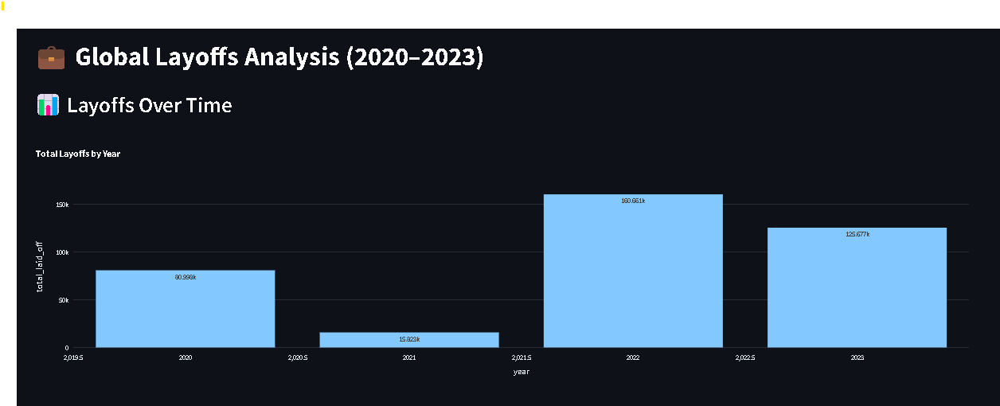
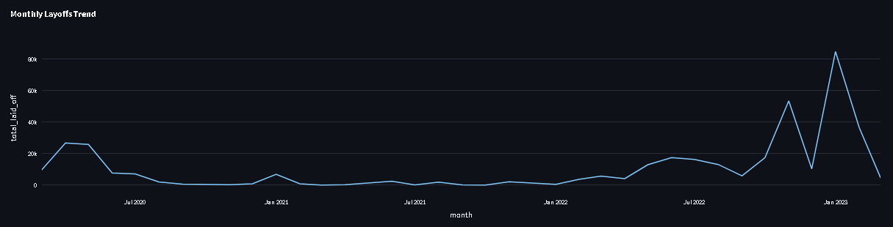
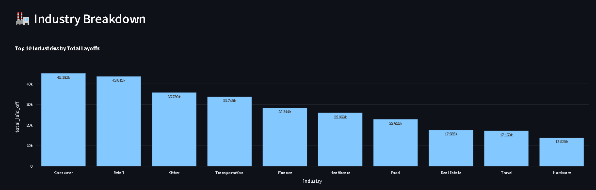
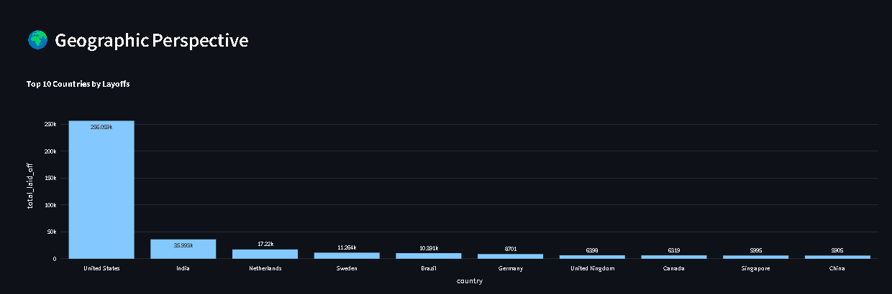
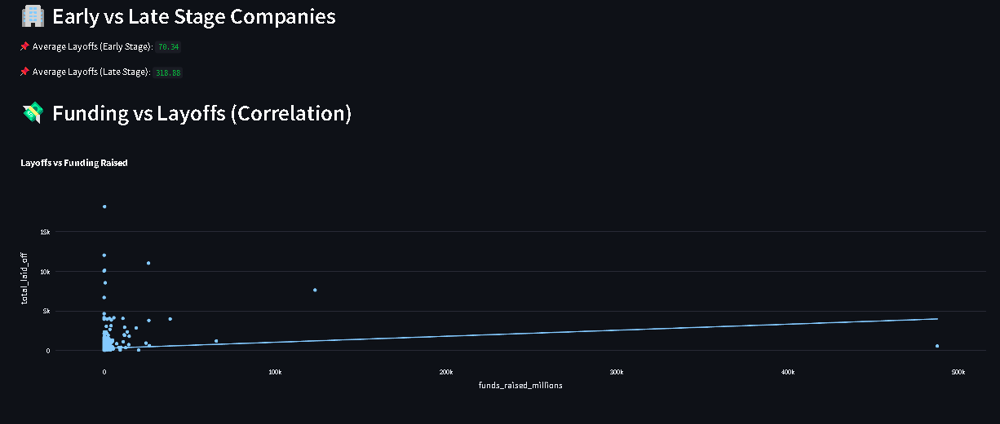

# 💼 Global Layoffs Analysis Dashboard (2020–2023)

This project provides a Streamlit-based interactive dashboard to explore global layoffs data from 2020 to 2023. It analyzes patterns by **industry**, **country**, **company stage**, and **funding raised**, helping identify trends and potential risk indicators for large-scale layoffs.

## 🚀 Features

- 📊 **Layoffs Over Time** – Yearly and monthly trends
- 🏭 **Industry Impact** – Top industries by total layoffs
- 🌍 **Geographic Perspective** – Top affected countries
- 🏢 **Company Stage Analysis** – Early vs. late-stage company layoffs
- 💸 **Funding vs Layoffs** – Correlation visualization
- 🧾 **Raw Data Viewer** – Inspect original records

## 📦 Installation & Usage

1. Clone the repository:
   https://github.com/mohamed-makrani/Global-Layoffs-Analysis-Dashboard.git

2. Install dependencies:
   pip install -r requirements.txt

3. Run the Streamlit app:
   streamlit run Dashboard.py

📊 Dataset Columns
company

location

industry

total_laid_off

percentage_laid_off

date

stage

country

funds_raised_millions

## 🖼️ Screenshots

### 🔹 Dashboard Overview

### 🔹 Industry and Country Breakdown

### 🔹 Funding vs Layoffs

📝 License
This project is licensed under the MIT License.

🙌 Acknowledgements
Built using Streamlit, Pandas, and Plotly
